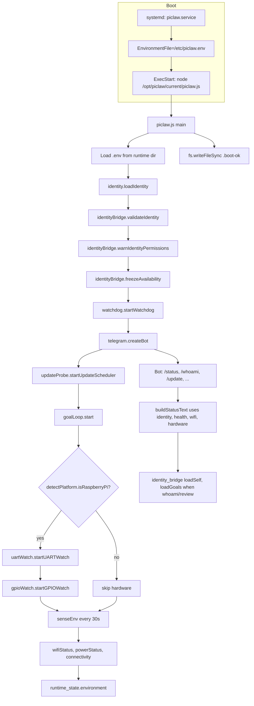
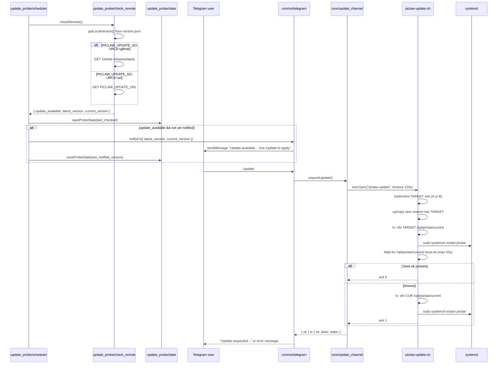
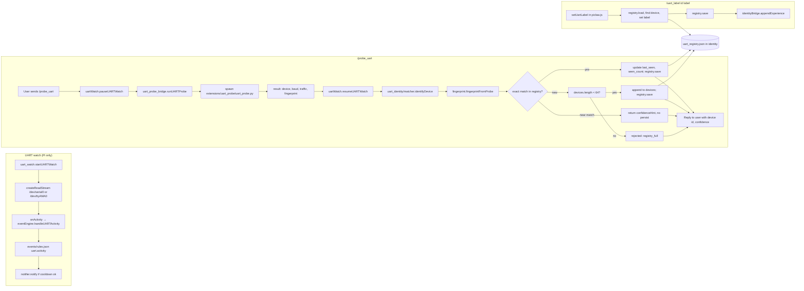
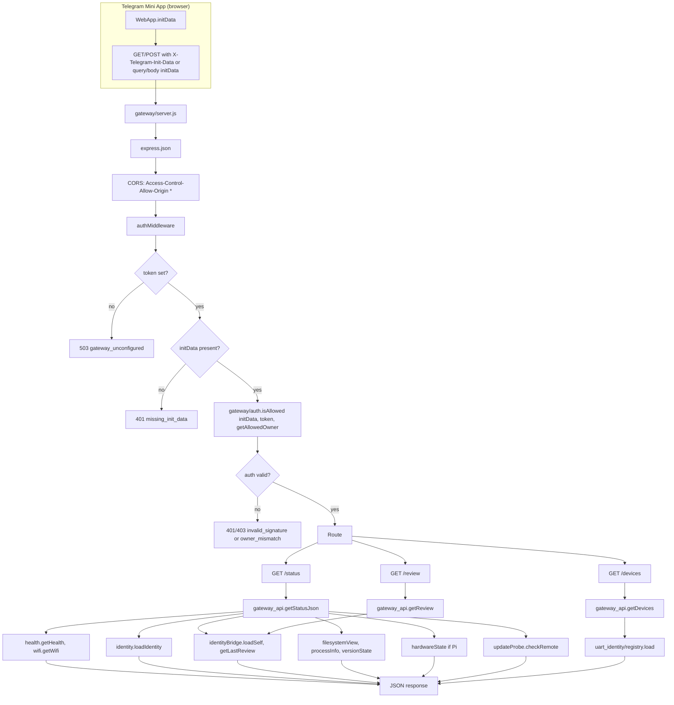

# Piclaw — runtime diagrams (as-built audit)

Mermaid diagrams for main flows. Exact as per current code paths.

---

## 1. Runtime flow: boot → systemd → piclaw.js → sensors → telegram → identity

---

## 2. Update flow: probe → notify → /update → piclaw-update → slot switch

---

## 3. UART flow: watch → /probe_uart pause → probe → matcher → registry → label

---

## 4. Mini-app flow: initData → gateway → gateway_api → identity/runtime

